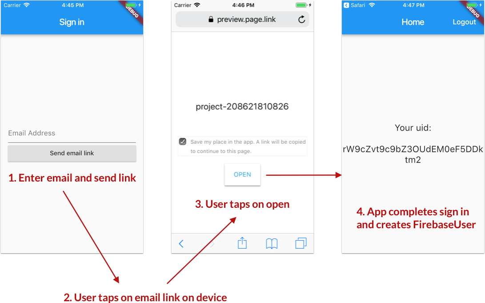

# Firebase passwordless sign-in - example app 

This sample app shows how to implement passwordless email sign in via an email link with Firebase.


## Preview



## Setup steps

The Firebase app needs to be configured correcly. I've been following these steps:

- [Authenticate with Firebase Using Email Link in iOS](https://firebase.google.com/docs/auth/ios/email-link-auth)
- [Authenticate with Firebase Using Email Link in Android](https://firebase.google.com/docs/auth/android/email-link-auth)
- [Passing State in Email Actions](https://firebase.google.com/docs/auth/ios/passing-state-in-email-actions#configuring_firebase_dynamic_links)

## Important note

Support for passwordless email sign in [has been requested](https://github.com/flutter/flutter/issues/22958) but has **not yet been implemented** in the Flutter Firebase repo. Details here:

### [#22958 - Missing Email-Link Sign-In in firebase_auth plugin](https://github.com/flutter/flutter/issues/22958)

Since I needed it for one of my projects, I forked the Firebase plugins repo and started implementing it myself on this branch:

- [bizz84/plugins](https://github.com/bizz84/plugins/tree/enable-passwordless-sign-in)

As part of this, I have implemented the necessary methods in Flutter and the iOS and Android counterparts:

- `sendLinkToEmail`
- `isSignInWithEmailLink`
- `signInWithEmailAndLink`

The result of this is a PR to the Firebase plugins repo:

### [#1159 - Enable passwordless sign in](https://github.com/flutter/plugins/pull/1159)


Unfortunately, the plugin code itself is not enough to complete the entire flow. 

To get things working, I added additional platform specific code to handle the incoming links and sending them back to Flutter via an `EventChannel`.

This is how the `AppDelegate` looks on iOS:

```swift
import UIKit
import Flutter
import Firebase

@UIApplicationMain
@objc class AppDelegate: FlutterAppDelegate {
  
  var eventChannel: FlutterEventChannel {
    guard let controller = window.rootViewController as? FlutterViewController else {
      fatalError("Invalid root view controller")
    }
    return FlutterEventChannel(name: "linkHandler", binaryMessenger: controller)
  }
  let linkStreamHandler = LinkStreamHandler()
  
  override func application(
    _ application: UIApplication,
    didFinishLaunchingWithOptions launchOptions: [UIApplication.LaunchOptionsKey: Any]?
    ) -> Bool {
    GeneratedPluginRegistrant.register(with: self)
    eventChannel.setStreamHandler(linkStreamHandler)
    return super.application(application, didFinishLaunchingWithOptions: launchOptions)
  }
  
  
  override func application(_ application: UIApplication, continue userActivity: NSUserActivity,
                            restorationHandler: @escaping ([UIUserActivityRestoring]?) -> Void) -> Bool {
    return userActivity.webpageURL.flatMap(handlePasswordlessSignIn)!
  }
  
  @available(iOS 9.0, *)
  override func application(_ app: UIApplication, open url: URL, options: [UIApplication.OpenURLOptionsKey : Any]) -> Bool {
    return application(app, open: url,
                       sourceApplication: options[UIApplication.OpenURLOptionsKey.sourceApplication] as? String,
                       annotation: "")
  }
  
  
  override func application(_ application: UIApplication, open url: URL, sourceApplication: String?, annotation: Any) -> Bool {
    return handlePasswordlessSignIn(withURL: url)
  }
  
  func handlePasswordlessSignIn(withURL url: URL) -> Bool {
    eventChannel.setStreamHandler(linkStreamHandler)
    return linkStreamHandler.handleLink(url.absoluteString)
  }
}

class LinkStreamHandler: NSObject, FlutterStreamHandler {
  
  var eventSink: FlutterEventSink?
  
  // links will be added to this queue until the sink is ready to process them
  var queuedLinks = [String]()
  
  func onListen(withArguments arguments: Any?, eventSink events: @escaping FlutterEventSink) -> FlutterError? {
    self.eventSink = events
    queuedLinks.forEach({ events($0) })
    queuedLinks.removeAll()
    return nil
  }
  
  func onCancel(withArguments arguments: Any?) -> FlutterError? {
    self.eventSink = nil
    return nil
  }
  
  func handleLink(_ link: String) -> Bool {
    guard let eventSink = eventSink else {
      queuedLinks.append(link)
      return false
    }
    eventSink(link)
    return true
  }
}
```

And here is the corresponding `MainActivity.kt` on Android:

```kt
package com.codingwithflutter.passwordless

import android.content.ContentValues.TAG
import android.net.Uri
import android.os.Bundle
import android.util.Log
import com.google.firebase.dynamiclinks.FirebaseDynamicLinks

import io.flutter.app.FlutterActivity
import io.flutter.plugin.common.EventChannel
import io.flutter.plugins.GeneratedPluginRegistrant

class MainActivity: FlutterActivity() {
  var linkStreamHandler: LinkStreamHandler? = null

  override fun onCreate(savedInstanceState: Bundle?) {
    super.onCreate(savedInstanceState)
    GeneratedPluginRegistrant.registerWith(this)
    linkStreamHandler = LinkStreamHandler()
    val channel = EventChannel(flutterView, "linkHandler")
    channel.setStreamHandler(linkStreamHandler)

    // https://firebase.google.com/docs/dynamic-links/android/receive
    // NOTE: This seems to crash the app on emulator with this log:
    // Error connecting to the service protocol: HttpException: Connection closed before full header was received, uri = http://127.0.0.1:53810/ws
    // See: https://github.com/flutter/flutter/issues/19056
    // It appears to work fine on real device
    FirebaseDynamicLinks.getInstance()
            .getDynamicLink(intent)
            .addOnSuccessListener(this) { pendingDynamicLinkData ->
              // Get deep link from result (may be null if no link is found)
              if (pendingDynamicLinkData != null) {
                var deepLink = pendingDynamicLinkData.link
                linkStreamHandler?.handleLink(deepLink.toString())
                  Log.i(TAG, "getDynamicLink:onSuccess -> " + deepLink.toString())
              } else {
                  Log.i(TAG, "getDynamicLink:onSuccess -> no link found")
              }
            }
            .addOnFailureListener(this) { e -> Log.w(TAG, "getDynamicLink:onFailure", e) }
  }
}

class LinkStreamHandler: EventChannel.StreamHandler {

  private var eventSink: EventChannel.EventSink? = null

  override fun onListen(
          arguments: Any?, eventSink: EventChannel.EventSink?) {
    this.eventSink = eventSink
  }
  override fun onCancel(arguments: Any?) {
    eventSink = null
  }

  fun handleLink(link: String) {
    eventSink?.success(link)
  }
}
```

This code uses `EventChannel` and `EventSink`, and is based on this article on Medium:

- [Flutter Platform Channels](https://medium.com/flutter-io/flutter-platform-channels-ce7f540a104e?linkId=56128409)

In summary, some native code is needed on the client app to receive the incoming email link, and pass it back to Flutter.

It would be great if all this could be included as part of the `FirebaseAuth` plugin itself, however I'm not sure that this is within the scope of the plugins repo.

Instead, it may be desirable to create a separate Flutter package to take care of the native code.

**For the time being, client apps can use this project as a template**. 

## Next steps

- [ ] Write a Flutter package to handle the email link properly, so that no custom code is needed in the client app
- [ ] Merge [this PR](https://github.com/flutter/plugins/pull/1159) back into `firebase_auth`.

Some help from the Flutter / Firebase team would be greatly appreciated to get this resolved. 🙏

## Adding passwordless sign-in to other apps

Until the plugin code is merged back into the official repo, you can use this version of `firebase_auth` in your `pubspec.yaml`:

```
firebase_auth:
  git:
    url: https://github.com/bizz84/plugins
    ref: enable-passwordless-sign-in
    path: packages/firebase_auth
```

Note that you will still need to follow the Firebase setup steps above.

## Keyboard not showing on Android Pie
If you're using Flutter ```1.0 stable```, there's a chance **Soft Keybord will not be triggered** when tapping on the TextField on Android Pie (SDK 28).

This is a known bug of the Flutter Framework and the fix is already available on the ```dev``` channel.
Original issue [here](https://github.com/flutter/flutter/issues/21911).

## Credits

[Paolo Rotolo](https://twitter.com/PaoloRotolo) for helping with the Android implementation and testing.

## [LICENSE: MIT](LICENSE.md)
